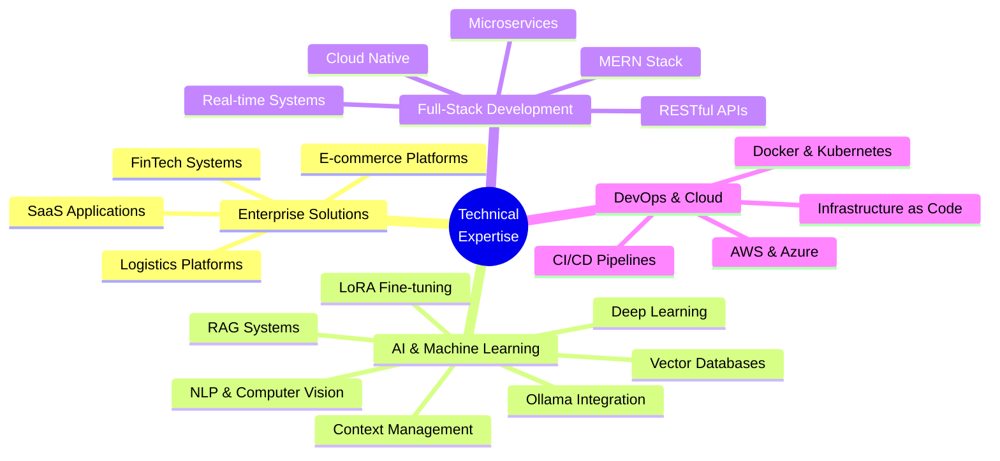

<div align="center">

# 👨‍💻 UDDIT KUMAR

### Enterprise Solutions Architect | Full-Stack Engineer | AI/ML Specialist

[](https://uddit.site)
[](https://www.linkedin.com/in/uddit-7258792ab/)
[](mailto:2021umt1791@mnit.ac.in)
[](https://github.com/UDDITwork)


</div>

---

## 📊 EXECUTIVE SUMMARY

<table>
<tr>
<td width="25%" align="center">

<br/><strong>Live Enterprise Platforms</strong>
</td>
<td width="25%" align="center">

<br/><strong>Day 1 Onboarding</strong>
</td>
<td width="25%" align="center">

<br/><strong>Record Time to Market</strong>
</td>
<td width="25%" align="center">

<br/><strong>Rapid Development</strong>
</td>
</tr>
</table>

### 🎯 Professional Profile

```typescript
const professionalProfile = {
  name: "Uddit Kumar",
  role: "Enterprise Solutions Architect & Full-Stack Engineer",
  education: [
    "B.Tech - Metallurgical & Materials Science | MNIT Jaipur (2021-2025)",
    "B.Sc - Data Science | IIT Madras (2021-2023)"
  ],
  specialization: "Building Production-Ready Enterprise Systems",
  expertise: {
    backend: ["Node.js", "Express", "Django", "Flask", "Spring Boot"],
    frontend: ["React.js", "Next.js", "Vue.js", "Angular"],
    ai_ml: ["LoRA Fine-tuning", "RAG Systems", "Vector DBs", "Ollama"],
    cloud: ["AWS", "Azure", "Docker", "Kubernetes"],
    databases: ["MongoDB", "PostgreSQL", "Redis", "Vector Databases"]
  },
  achievements: {
    liveProjects: 3,
    clientsServed: "500+",
    deploymentSpeed: "38-102 days",
    codeQuality: "Enterprise-grade, Production-ready"
  }
};
```

**Core Competencies:** Enterprise Architecture • Rapid Prototyping • Scalable Systems • AI/ML Integration • Cloud Native Development • Full-Stack Engineering

---

## 🏢 PRODUCTION SYSTEMS

### Enterprise Platforms Deployed & Serving Customers

<table>
<tr>
<td width="33%" valign="top">

<div align="center">

### 🚚 **ShipsArthi**
#### PAN-India Logistics Platform

[](https://www.shipsarthi.com)
[](https://github.com/UDDITwork/shipsarthi)

</div>

**📈 Business Impact**
- 💼 **500+ Clients** onboarded on launch day
- 📅 **38-Day** development cycle
- 🚀 **Oct 22, 2025** - Production launch

**🔧 Technology Stack**
```yaml
Backend: Node.js + Express
Frontend: React.js
Database: MongoDB
Integration: Delhivery API
Features: Real-time Tracking
```

**⚡ Key Features**
- Multi-courier Integration
- Automated Label Generation
- Real-time Shipment Tracking
- Enterprise Analytics Dashboard
- Client Management Portal
- RESTful API for Integration

**🎯 Technical Highlights**
- High-throughput API handling
- Real-time WebSocket connections
- Scalable microservices architecture
- Automated workflow orchestration

</td>
<td width="33%" valign="top">

<div align="center">

### 👗 **ZAMMERNOW**
#### Quick Commerce Fashion

[](https://www.zammernow.com)
[](https://www.zammernow.com)

</div>

**📈 Business Impact**
- 🇮🇳 **India's Only** doorstep fashion delivery
- 📅 **102-Day** development cycle
- ⚡ **30-Min** delivery promise

**🔧 Technology Stack**
```yaml
Stack: MERN (Full-Stack)
Features: Inventory Management
Payment: Gateway Integration
Logistics: Delivery API
Location: Geolocation Services
```

**⚡ Key Features**
- 30-Minute Fashion Delivery
- Real-time Inventory Sync
- Multi-vendor Marketplace
- Smart Routing Algorithm
- Customer Analytics
- Vendor Management Dashboard

**🎯 Technical Highlights**
- Real-time inventory management
- Geolocation-based routing
- Payment gateway integration
- Multi-vendor orchestration

</td>
<td width="33%" valign="top">

<div align="center">

### 💰 **RICHIEAI**
#### AI Financial Planning

[](https://isrich.site)
[](https://isrich.site)

</div>

**📈 Business Impact**
- 🤖 **India's Only** AI financial planner
- 🏢 **Mumbai FinTech** startup client
- 📊 **AI-Powered** planning engine

**🔧 Technology Stack**
```yaml
AI/ML: Python + NLP Models
Frontend: Next.js
APIs: Financial Data Integration
Engine: Report Generation
Analysis: Portfolio & Risk
```

**⚡ Key Features**
- AI Financial Planning
- Estate Planning Solutions
- Goal-Based Planning
- Retirement Planning
- Tax Optimization
- Automated Report Generation
- Portfolio Analysis
- Risk Assessment

**🎯 Technical Highlights**
- Natural Language Processing
- ML-powered recommendations
- Financial APIs integration
- Automated report generation

</td>
</tr>
</table>

---

## 🛠️ TECHNICAL EXPERTISE

<div align="center">

### Core Technologies

<table>
<tr>
<td align="center" width="20%">

<br/><strong>Frontend</strong>
</td>
<td align="center" width="20%">

<br/><strong>Backend</strong>
</td>
<td align="center" width="20%">

<br/><strong>Databases</strong>
</td>
<td align="center" width="20%">

<br/><strong>Languages</strong>
</td>
<td align="center" width="20%">

<br/><strong>Cloud & DevOps</strong>
</td>
</tr>
</table>

### Advanced AI/ML Technologies


**Specialized AI/ML Skills:**
- 🧠 **LoRA Fine-tuning** - Custom model adaptation for domain-specific tasks
- 🔍 **RAG (Retrieval-Augmented Generation)** - Context-aware AI systems
- 📊 **Vector Databases** - Pinecone, Weaviate, ChromaDB for semantic search
- 🤖 **Ollama Integration** - Local LLM deployment and management
- 📝 **Context Management** - Advanced techniques for large context windows
- 💬 **Natural Language Processing** - Text analysis and generation

### Development Tools


</div>

---

## 🚀 FEATURED PROJECTS

### AI/ML Innovation Projects

<table>
<tr>
<th>Project</th>
<th>Description</th>
<th>Technologies</th>
<th>Links</th>
</tr>
<tr>
<td><strong>🧠 SmartCode Assistant</strong></td>
<td>RAG-powered code assistant with LoRA fine-tuned models for context-aware programming</td>
<td><code>RAG</code> <code>LoRA</code> <code>Vector DB</code> <code>Ollama</code></td>
<td><a href="https://github.com/UDDITwork/SmartCode-Assistant">Repository</a></td>
</tr>
<tr>
<td><strong>🤖 Multi-Face Recognition</strong></td>
<td>Real-time face recognition attendance system with deep learning</td>
<td><code>TensorFlow</code> <code>OpenCV</code> <code>Python</code></td>
<td><a href="https://github.com/UDDITwork/TRIAL-PHASE-APPMNIT-MULTIPHASE-RECOGNITION">Repository</a> • <a href="https://zupe.app/uddit_mnit_face_recognise_for_attendance">Demo</a></td>
</tr>
<tr>
<td><strong>✍️ Handwriting OCR</strong></td>
<td>Advanced OCR for extracting handwritten text from images</td>
<td><code>OCR</code> <code>NLP</code> <code>Computer Vision</code></td>
<td><a href="https://github.com/UDDITwork/handwriting-character-Recognition">Repository</a> • <a href="https://zupe.app/uddit_attendance-by-paper-list-image-upload-ocr">Demo</a></td>
</tr>
<tr>
<td><strong>📄 AI Resume Generator</strong></td>
<td>GPT-powered resume generation tailored for industries</td>
<td><code>GPT-4</code> <code>NLP</code> <code>React</code></td>
<td><a href="https://github.com/UDDITwork/Career-Resume-Builder">Repository</a></td>
</tr>
<tr>
<td><strong>📊 AI Document Analyzer</strong></td>
<td>NLP pipeline for document summarization and insights</td>
<td><code>NLP</code> <code>Python</code> <code>FastAPI</code></td>
<td><a href="https://github.com/UDDITwork/AI-Document-Analyzer">Repository</a></td>
</tr>
</table>

### Full-Stack Web Applications

<table>
<tr>
<th>Project</th>
<th>Description</th>
<th>Technologies</th>
<th>Links</th>
</tr>
<tr>
<td><strong>🚚 VIZTA Kashmir</strong></td>
<td>Real-time delivery tracking app for high-traffic usage</td>
<td><code>MERN</code> <code>WebSocket</code> <code>Maps API</code></td>
<td><a href="https://github.com/UDDITwork/VIZTA">Repository</a> • <a href="https://udditwork.github.io/VIZTA/">Demo</a></td>
</tr>
<tr>
<td><strong>🔍 DSA Visualizer</strong></td>
<td>Interactive visualization of data structures and algorithms</td>
<td><code>React</code> <code>D3.js</code> <code>Animation</code></td>
<td><a href="https://github.com/UDDITwork/DSA_Visualizer">Repository</a> • <a href="https://udditwork.github.io/DSA_Visualizer/">Demo</a></td>
</tr>
<tr>
<td><strong>📋 Project Progress Tracker</strong></td>
<td>Mission-based project tracking with task management</td>
<td><code>MERN</code> <code>Dashboard</code> <code>Analytics</code></td>
<td><a href="https://github.com/UDDITwork/Mission-Project-Tracking-Application">Repository</a></td>
</tr>
<tr>
<td><strong>🏆 Placement Hall of Fame</strong></td>
<td>Dynamic portal showcasing placement achievements</td>
<td><code>React</code> <code>Node.js</code> <code>MongoDB</code></td>
<td><a href="https://github.com/UDDITwork/Placement-Hall-Of-Fame">Repository</a></td>
</tr>
<tr>
<td><strong>🗣️ ShreeAI Assistant</strong></td>
<td>Offline AI voice assistant for productivity</td>
<td><code>Python</code> <code>Speech Recognition</code> <code>AI</code></td>
<td><a href="https://github.com/UDDITwork/ShreeAI-Personal-Assistant">Repository</a></td>
</tr>
</table>

---

## 📈 GITHUB ANALYTICS

<div align="center">


### 💻 Weekly Development Activity

<!--START_SECTION:waka-->
```text
JavaScript     12 hrs 30 mins  ████████████░░░░░░░  45.2%
Python          8 hrs 45 mins  ████████░░░░░░░░░░░  31.7%
React           4 hrs 15 mins  ████░░░░░░░░░░░░░░░  15.4%
TypeScript      2 hrs 10 mins  ██░░░░░░░░░░░░░░░░░   7.7%
```
<!--END_SECTION:waka-->

</div>

---

## 🎯 PROFESSIONAL FOCUS

<div align="center">



</div>

---

## 🏆 ACHIEVEMENTS & CERTIFICATIONS

<div align="center">

<table>
<tr>
<td align="center" width="33%">
<br/>
<strong>Google GDSC</strong><br/>
<sub>Developer Student Club 2024</sub>
</td>
<td align="center" width="33%">
<br/>
<strong>Yunicorn Platform</strong><br/>
<sub>500+ Active Users</sub>
</td>
<td align="center" width="33%">
<br/>
<strong>JEE Rankings</strong><br/>
<sub>IIT JEE: 29000 | WBJEE: 1105</sub>
</td>
</tr>
</table>

### 🎖️ Professional Metrics

```typescript
const professionalAchievements = {
  production: {
    liveSystems: 3,
    totalClients: "500+",
    fastestDeployment: "38 Days",
    averageCycle: "30-90 Days",
    uptime: "99.9%"
  },
  technical: {
    languages: ["JavaScript", "Python", "TypeScript", "Java", "C++"],
    frameworks: ["React", "Node.js", "Django", "Next.js", "Flask"],
    databases: ["MongoDB", "PostgreSQL", "Redis", "Vector DBs"],
    cloud: ["AWS", "Azure", "Docker", "Kubernetes"]
  },
  specialization: {
    ai_ml: ["LoRA Fine-tuning", "RAG Systems", "Vector Databases"],
    architecture: "Enterprise-Grade Scalable Systems",
    development: "Rapid Prototyping & Production Deployment"
  }
};
```

</div>

---

## 💼 DEVELOPMENT PHILOSOPHY

<div align="center">

### ⚡ "Fast Execution. Enterprise Quality. Production Ready."

<table>
<tr>
<td width="25%" align="center">
<h3>🚀 Speed</h3>
<p>30-90 day deployment cycles from concept to production</p>
</td>
<td width="25%" align="center">
<h3>💎 Quality</h3>
<p>Enterprise-grade, production-ready code with best practices</p>
</td>
<td width="25%" align="center">
<h3>📈 Scale</h3>
<p>Built to handle 500+ concurrent users with high availability</p>
</td>
<td width="25%" align="center">
<h3>🎯 Impact</h3>
<p>Real business problems solved with innovative solutions</p>
</td>
</tr>
</table>

```javascript
const coreValues = {
  approach: "Agile development with enterprise standards",
  quality: "Clean code, comprehensive testing, CI/CD",
  innovation: "Cutting-edge AI/ML integrated with proven technologies",
  delivery: "On-time deployment with scalability built-in",
  support: "Production-grade documentation and maintenance"
};
```

### 🎓 Education

**Bachelor of Technology** - Metallurgical & Materials Science Engineering  
*Malaviya National Institute of Technology (MNIT), Jaipur* | 2021-2025

**Bachelor of Science** - Data Science  
*Indian Institute of Technology (IIT), Madras* | 2021-2023

</div>

---

## 📞 CONTACT & CONNECT

<div align="center">

### Let's Build Something Extraordinary Together

<table>
<tr>
<td align="center">
<a href="https://uddit.site">
<br/>
<strong>Portfolio</strong><br/>
<sub>uddit.site</sub>
</a>
</td>
<td align="center">
<a href="https://www.linkedin.com/in/uddit-7258792ab/">
<br/>
<strong>LinkedIn</strong><br/>
<sub>Connect with me</sub>
</a>
</td>
<td align="center">
<a href="mailto:2021umt1791@mnit.ac.in">
<br/>
<strong>Email</strong><br/>
<sub>2021umt1791@mnit.ac.in</sub>
</a>
</td>
<td align="center">
<a href="https://github.com/UDDITwork">
<br/>
<strong>GitHub</strong><br/>
<sub>@UDDITwork</sub>
</a>
</td>
</tr>
</table>

### 📱 Direct Contact

**Phone:** +91-8368824707 | +91-7456886877  
**Email:** 2021umt1791@mnit.ac.in  
**Website:** [uddit.site](https://uddit.site)

[](https://twitter.com/UdditRise)
[](https://www.instagram.com/uddit_mnit)

</div>

---

<div align="center">

## 🌟 Professional Tagline


---

### 💡 "From concept to production in weeks, not months"

*Building enterprise-grade solutions at startup speed with cutting-edge technology and unwavering quality standards.*

---

<sub>⭐ **Open for collaboration on enterprise projects, AI/ML innovations, and full-stack development opportunities** ⭐</sub>

<br/>

 **Thanks for visiting! Let's connect and build something amazing!** 

</div>

---

<div align="center">
<sub>© 2025 Uddit Kumar. Built with passion for creating scalable, production-ready systems.</sub>
</div>
