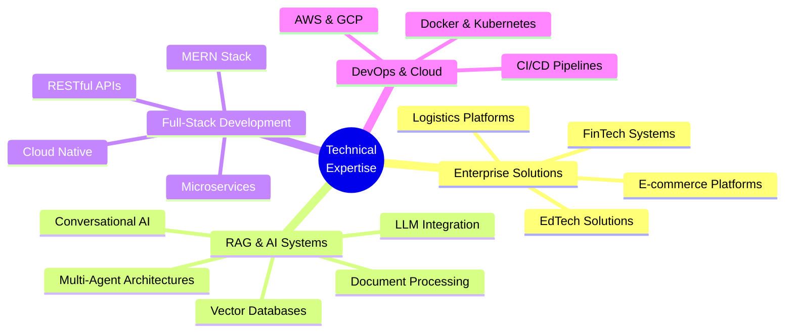

<div align="center">

# 👨‍💻 UDDIT 

### Enterprise Solutions Architect | Full-Stack Engineer | AI/ML Specialist

[](https://uddit.site)
[](https://www.linkedin.com/in/uddit-7258792ab/)
[](mailto:2021umt1791@mnit.ac.in)
[](https://github.com/UDDITwork)


</div>

---

## 📊 EXECUTIVE SUMMARY

<table>
<tr>
<td width="25%" align="center">

<br/><strong>Live Enterprise Platforms</strong>
</td>
<td width="25%" align="center">

<br/><strong>Day 1 Onboarding</strong>
</td>
<td width="25%" align="center">

<br/><strong>Record Time to Market</strong>
</td>
<td width="25%" align="center">

<br/><strong>AI-Powered Platforms</strong>
</td>
</tr>
</table>

### 🎯 Professional Profile
```typescript
const professionalProfile = {
  name: "Uddit",
  role: "Enterprise Solutions Architect & Full-Stack Engineer",
  education: [
    "B.Tech - NIT Jaipur (2021-2025)",
    "B.S. Data Science - IIT Madras (2021-2023)"
  ],
  specialization: "Building Production-Ready Enterprise & AI Systems",
  expertise: {
    backend: ["Node.js", "Express", "Django", "Flask", "FastAPI"],
    frontend: ["React.js", "Next.js", "Vue.js", "Angular"],
    ai_ml: ["RAG Systems", "LangChain", "LangGraph", "Vector DBs", "LLM Fine-tuning"],
    cloud: ["AWS", "Azure", "GCP", "Docker", "Kubernetes"],
    databases: ["MongoDB", "PostgreSQL", "Redis", "Pinecone", "ChromaDB"]
  },
  achievements: {
    liveProjects: 8,
    ragSystems: 4,
    clientsServed: "500+",
    deploymentSpeed: "38-102 days"
  }
};
```

**Core Competencies:** Enterprise Architecture • RAG Systems • Multi-Agent AI • Scalable Systems • Cloud Native Development • Full-Stack Engineering

---

## 🏢 PRODUCTION SYSTEMS

### Enterprise Platforms Deployed & Serving Customers

<table>
<tr>
<td width="25%" valign="top">

<div align="center">

### 🚚 **ShipsArthi**
#### PAN-India Logistics Platform

[](https://www.shipsarthi.com)
[](https://github.com/UDDITwork/shipsarthi)

</div>

**📈 Business Impact**
- 💼 **500+ Clients** onboarded on launch day
- 📅 **38-Day** development cycle
- 🚀 **Oct 22, 2025** - Production launch

**🔧 Technology Stack**
```yaml
Backend: Node.js + Express
Frontend: React.js
Database: MongoDB
Integration: Delhivery API
Features: Real-time Tracking
```

**⚡ Key Features**
- Multi-courier Integration
- Automated Label Generation
- Real-time Shipment Tracking
- Enterprise Analytics Dashboard
- Client Management Portal
- RESTful API for Integration

**🎯 Technical Highlights**
- High-throughput API handling
- Real-time WebSocket connections
- Scalable microservices architecture
- Automated workflow orchestration

</td>
<td width="25%" valign="top">

<div align="center">

### 👗 **ZAMMERNOW**
#### Quick Commerce Fashion

[](https://www.zammernow.com)
[](https://www.zammernow.com)

</div>

**📈 Business Impact**
- 🇮🇳 **India's Only** doorstep fashion delivery
- 📅 **102-Day** development cycle
- ⚡ **30-Min** delivery promise

**🔧 Technology Stack**
```yaml
Stack: MERN (Full-Stack)
Features: Inventory Management
Payment: Gateway Integration
Logistics: Delivery API
Location: Geolocation Services
```

**⚡ Key Features**
- 30-Minute Fashion Delivery
- Real-time Inventory Sync
- Multi-vendor Marketplace
- Smart Routing Algorithm
- Customer Analytics
- Vendor Management Dashboard

**🎯 Technical Highlights**
- Real-time inventory management
- Geolocation-based routing
- Payment gateway integration
- Multi-vendor orchestration

</td>
<td width="25%" valign="top">

<div align="center">

### 💰 **RICHIEAI**
#### AI Financial Planning

[](https://isrich.site)
[](https://isrich.site)

</div>

**📈 Business Impact**
- 🤖 **India's Only** AI financial planner
- 🏢 **Mumbai FinTech** startup client
- 📊 **AI-Powered** planning engine

**🔧 Technology Stack**
```yaml
AI/ML: Python + NLP Models
Frontend: Next.js
APIs: Financial Data Integration
Engine: Report Generation
Analysis: Portfolio & Risk
```

**⚡ Key Features**
- AI Financial Planning
- Estate Planning Solutions
- Goal-Based Planning
- Retirement Planning
- Tax Optimization
- Automated Report Generation
- Portfolio Analysis
- Risk Assessment

**🎯 Technical Highlights**
- Natural Language Processing
- ML-powered recommendations
- Financial APIs integration
- Automated report generation

</td>
<td width="25%" valign="top">

<div align="center">

### 💎 **GANTAVYAM**
#### Safe Ride Booking for Women

[](https://gantavyam.site)
[](https://gantavyam.site)

</div>

**📈 Business Impact**
- 🛡️ **Women Safety** focused platform
- 🚗 **Delhi NCR** service coverage
- ✅ **Verified Drivers** only

**🔧 Technology Stack**
```yaml
Frontend: React.js
Backend: Node.js + Express
Database: MongoDB
Maps: Google Maps API
```

**⚡ Key Features**
- Verified Female Drivers
- Real-time Ride Tracking
- Emergency SOS Button
- Trusted Contact Alerts
- Rating & Review System

**🎯 Technical Highlights**
- Real-time GPS tracking
- Secure authentication
- Emergency alert system
- Route optimization

</td>
</tr>
</table>

---

## 🤖 RAG-POWERED AI SYSTEMS

### Production AI Platforms Built with Retrieval-Augmented Generation

<table>
<tr>
<td width="25%" valign="top">

<div align="center">

### 🕉️ **SHREE AI**
#### Personal AI Assistant

[](https://shreeai.site)
[](https://shreeai.site)

</div>

**📈 Platform Highlights**
- 🧠 **Personal AI** with memory & context
- 💬 **Multi-modal** conversations
- 🔒 **Privacy-first** architecture

**🔧 Technology Stack**
```yaml
AI Framework: LangChain + LangGraph
Vector DB: Pinecone
LLM: OpenAI GPT-4 / Claude
Backend: FastAPI + Python
Frontend: Next.js
Memory: Redis + Vector Store
```

**⚡ Key Features**
- Contextual Memory System
- Document Upload & Analysis
- Multi-turn Conversations
- Personalized Responses
- Knowledge Base Integration
- Voice Input Support

**🎯 RAG Implementation**
- Semantic document chunking
- Hybrid search (dense + sparse)
- Context window optimization
- Conversation history retrieval
- Dynamic prompt engineering

</td>
<td width="25%" valign="top">

<div align="center">

### ✍️ **PATFACE**
#### AI Patent Drafting Tool

[](https://patface.com)
[](https://agentic-patent-tool.online)

</div>

**📈 Platform Highlights**
- ⚡ **99.6%** time reduction in drafting
- 🌍 **IPO/USPTO/EPO** compliant
- 🤖 **Multi-Agent** architecture

**🔧 Technology Stack**
```yaml
AI Framework: LangChain + LangGraph
Vector DB: Pinecone
LLM: Anthropic Claude API
Backend: Python + FastAPI
Frontend: React.js
Agents: CrewAI / AutoGen
```

**⚡ Key Features**
- Multi-Agent RAG System
- Prior Art Search & Analysis
- Claims Generation
- Specification Drafting
- Patent Format Compliance
- Citation Management

**🎯 RAG Implementation**
- Patent corpus embedding
- Multi-agent orchestration
- Legal compliance retrieval
- Prior art semantic search
- Claims validation pipeline

</td>
<td width="25%" valign="top">

<div align="center">

### ⭐ **REVIEWBUDDY**
#### AI Review Analysis Platform

[](https://reviewbuddy.site)
[](https://reviewbuddy.site)

</div>

**📈 Platform Highlights**
- 📊 **Sentiment Analysis** at scale
- 🔍 **Competitive Intelligence**
- 📈 **Actionable Insights**

**🔧 Technology Stack**
```yaml
AI Framework: LangChain
Vector DB: ChromaDB
LLM: OpenAI GPT-4
Backend: Node.js + Python
Frontend: React.js
NLP: spaCy + Transformers
```

**⚡ Key Features**
- Multi-platform Review Scraping
- Sentiment Classification
- Theme Extraction
- Competitor Comparison
- Trend Analysis
- Export Reports

**🎯 RAG Implementation**
- Review corpus indexing
- Aspect-based retrieval
- Comparative analysis RAG
- Temporal trend extraction
- Summary generation pipeline

</td>
<td width="25%" valign="top">

<div align="center">

### 🎓 **SIVI ACADEMY**
#### AI-Powered EdTech Platform

[](https://siviacademy.in)
[](https://siviacademy.in)

</div>

**📈 Platform Highlights**
- 📚 **AI Tutoring** system
- 🎯 **Personalized Learning** paths
- 📝 **Smart Assessments**

**🔧 Technology Stack**
```yaml
AI Framework: LangChain
Vector DB: Pinecone
LLM: OpenAI + Gemini
Backend: Django + FastAPI
Frontend: Next.js
Database: PostgreSQL
```

**⚡ Key Features**
- AI Course Assistant
- Doubt Resolution Bot
- Personalized Recommendations
- Progress Tracking
- Quiz Generation
- Study Material RAG

**🎯 RAG Implementation**
- Course content embedding
- Syllabus-aware retrieval
- Adaptive question generation
- Knowledge gap detection
- Learning path optimization

</td>
</tr>
</table>

---

## 🛠️ TECHNICAL EXPERTISE

<div align="center">

### Core Technologies

<table>
<tr>
<td align="center" width="20%">

<br/><strong>Frontend</strong>
</td>
<td align="center" width="20%">

<br/><strong>Backend</strong>
</td>
<td align="center" width="20%">

<br/><strong>Databases</strong>
</td>
<td align="center" width="20%">

<br/><strong>Languages</strong>
</td>
<td align="center" width="20%">

<br/><strong>Cloud & DevOps</strong>
</td>
</tr>
</table>

### Advanced AI/ML & RAG Technologies


**Specialized AI/ML Skills:**
- 🔍 **RAG Systems** - Production-grade retrieval-augmented generation pipelines
- 🤖 **Multi-Agent Systems** - LangGraph, CrewAI, AutoGen orchestration
- 🧠 **LLM Integration** - OpenAI, Anthropic Claude, Gemini, Ollama
- 📊 **Vector Databases** - Pinecone, Weaviate, ChromaDB, Qdrant
- 🔧 **Fine-tuning** - LoRA, QLoRA for domain-specific models
- 💬 **Conversational AI** - Context management, memory systems, prompt engineering

### Development Tools


</div>

---

## 🚀 FEATURED PROJECTS

### AI/ML Innovation Projects

<table>
<tr>
<th>Project</th>
<th>Description</th>
<th>Technologies</th>
<th>Links</th>
</tr>
<tr>
<td><strong>🕉️ Shree AI Assistant</strong></td>
<td>Personal AI with contextual memory, document analysis & multi-modal support</td>
<td><code>RAG</code> <code>LangChain</code> <code>Pinecone</code> <code>GPT-4</code></td>
<td><a href="https://shreeai.site">Live</a></td>
</tr>
<tr>
<td><strong>✍️ PatFace - Patent AI</strong></td>
<td>Multi-agent patent drafting reducing time by 99.6% for IPO/USPTO/EPO</td>
<td><code>LangGraph</code> <code>Claude API</code> <code>RAG</code> <code>Agents</code></td>
<td><a href="https://patface.com">Live</a> • <a href="https://agentic-patent-tool.online">Mirror</a></td>
</tr>
<tr>
<td><strong>⭐ ReviewBuddy</strong></td>
<td>AI-powered review sentiment analysis & competitive intelligence platform</td>
<td><code>RAG</code> <code>NLP</code> <code>ChromaDB</code> <code>Transformers</code></td>
<td><a href="https://reviewbuddy.site">Live</a></td>
</tr>
<tr>
<td><strong>🎓 Sivi Academy</strong></td>
<td>AI tutoring platform with personalized learning & RAG-based doubt resolution</td>
<td><code>RAG</code> <code>LangChain</code> <code>Next.js</code> <code>Django</code></td>
<td><a href="https://siviacademy.in">Live</a></td>
</tr>
<tr>
<td><strong>✍️ Handwriting OCR</strong></td>
<td>Advanced OCR for extracting handwritten text from images</td>
<td><code>OCR</code> <code>NLP</code> <code>Computer Vision</code></td>
<td><a href="https://github.com/UDDITwork/handwriting-character-Recognition">Repository</a> • <a href="https://zupe.app/uddit_attendance-by-paper-list-image-upload-ocr">Demo</a></td>
</tr>
<tr>
<td><strong>📄 AI Resume Generator</strong></td>
<td>GPT-powered resume generation tailored for industries</td>
<td><code>GPT-4</code> <code>NLP</code> <code>React</code></td>
<td><a href="https://github.com/UDDITwork/Career-Resume-Builder">Repository</a></td>
</tr>
</table>

### Full-Stack Web Applications

<table>
<tr>
<th>Project</th>
<th>Description</th>
<th>Technologies</th>
<th>Links</th>
</tr>
<tr>
<td><strong>🔍 DSA Visualizer</strong></td>
<td>Interactive visualization of data structures and algorithms</td>
<td><code>React</code> <code>D3.js</code> <code>Animation</code></td>
<td><a href="https://github.com/UDDITwork/DSA_Visualizer">Repository</a> • <a href="https://udditwork.github.io/DSA_Visualizer/">Demo</a></td>
</tr>
<tr>
<td><strong>📋 Project Progress Tracker</strong></td>
<td>Mission-based project tracking with task management</td>
<td><code>MERN</code> <code>Dashboard</code> <code>Analytics</code></td>
<td><a href="https://github.com/UDDITwork/Mission-Project-Tracking-Application">Repository</a></td>
</tr>
<tr>
<td><strong>🏆 Placement Hall of Fame</strong></td>
<td>Dynamic portal showcasing placement achievements</td>
<td><code>React</code> <code>Node.js</code> <code>MongoDB</code></td>
<td><a href="https://github.com/UDDITwork/Placement-Hall-Of-Fame">Repository</a></td>
</tr>
</table>

---

## 📈 GITHUB ANALYTICS

<div align="center">


### 💻 Weekly Development Activity

<!--START_SECTION:waka-->
```text
Python         14 hrs 30 mins  █████████████░░░░░░  48.3%
JavaScript     10 hrs 15 mins  █████████░░░░░░░░░░  34.2%
TypeScript      3 hrs 45 mins  ███░░░░░░░░░░░░░░░░  12.5%
YAML            1 hr 30 mins   █░░░░░░░░░░░░░░░░░░   5.0%
```
<!--END_SECTION:waka-->

</div>

---

## 🎯 PROFESSIONAL FOCUS

<div align="center">


</div>

---

## 🏆 ACHIEVEMENTS & CERTIFICATIONS

<div align="center">

<table>
<tr>
<td align="center" width="25%">
<br/>
<strong>RAG Systems</strong><br/>
<sub>4+ Production AI Platforms</sub>
</td>
<td align="center" width="25%">
<br/>
<strong>Enterprise Platforms</strong><br/>
<sub>8 Live Systems</sub>
</td>
<td align="center" width="25%">
<br/>
<strong>Google GDSC</strong><br/>
<sub>Developer Student Club 2024</sub>
</td>
<td align="center" width="25%">
<br/>
<strong>JEE Rankings</strong><br/>
<sub>IIT JEE: 29000 | WBJEE: 1105</sub>
</td>
</tr>
</table>

### 🎖️ Professional Metrics
```typescript
const professionalAchievements = {
  production: {
    liveSystems: 8,
    ragPlatforms: 4,
    totalClients: "500+",
    fastestDeployment: "38 Days",
    uptime: "99.9%"
  },
  aiSpecialization: {
    ragSystems: ["Shree AI", "PatFace", "ReviewBuddy", "Sivi Academy"],
    frameworks: ["LangChain", "LangGraph", "CrewAI", "LlamaIndex"],
    vectorDBs: ["Pinecone", "ChromaDB", "Weaviate", "Qdrant"],
    llms: ["GPT-4", "Claude", "Gemini", "Llama", "Ollama"]
  },
  technical: {
    languages: ["Python", "JavaScript", "TypeScript", "Java"],
    frameworks: ["React", "Next.js", "Node.js", "Django", "FastAPI"],
    cloud: ["AWS", "GCP", "Azure", "Docker", "Kubernetes"]
  }
};
```

</div>

---

## 💼 DEVELOPMENT PHILOSOPHY

<div align="center">

### ⚡ "Fast Execution. Enterprise Quality. AI-First."

<table>
<tr>
<td width="25%" align="center">
<h3>🚀 Speed</h3>
<p>30-90 day deployment cycles from concept to production</p>
</td>
<td width="25%" align="center">
<h3>🤖 AI-Native</h3>
<p>RAG systems & multi-agent architectures for intelligent solutions</p>
</td>
<td width="25%" align="center">
<h3>📈 Scale</h3>
<p>Built to handle 500+ concurrent users with high availability</p>
</td>
<td width="25%" align="center">
<h3>🎯 Impact</h3>
<p>Real business problems solved with cutting-edge AI</p>
</td>
</tr>
</table>
```javascript
const coreValues = {
  approach: "AI-first development with enterprise standards",
  quality: "Production-grade RAG systems with comprehensive testing",
  innovation: "Multi-agent architectures integrated with proven stacks",
  delivery: "On-time deployment with scalability built-in",
  expertise: "Deep knowledge in LLMs, vector databases & retrieval systems"
};
```

### 🎓 Education

**Bachelor of Technology** - Metallurgical & Materials Science Engineering  
*Malaviya National Institute of Technology (MNIT), Jaipur* | 2021-2025

**Bachelor of Science** - Data Science  
*Indian Institute of Technology (IIT), Madras* | 2021-2023

</div>

---

## 📞 CONTACT & CONNECT

<div align="center">

### Let's Build Something Extraordinary Together

<table>
<tr>
<td align="center">
<a href="https://uddit.site">
<br/>
<strong>Portfolio</strong><br/>
<sub>uddit.site</sub>
</a>
</td>
<td align="center">
<a href="https://shreeai.site">
<br/>
<strong>Shree AI</strong><br/>
<sub>shreeai.site</sub>
</a>
</td>
<td align="center">
<a href="https://www.linkedin.com/in/uddit-7258792ab/">
<br/>
<strong>LinkedIn</strong><br/>
<sub>Connect with me</sub>
</a>
</td>
<td align="center">
<a href="mailto:2021umt1791@mnit.ac.in">
<br/>
<strong>Email</strong><br/>
<sub>2021umt1791@mnit.ac.in</sub>
</a>
</td>
<td align="center">
<a href="https://github.com/UDDITwork">
<br/>
<strong>GitHub</strong><br/>
<sub>@UDDITwork</sub>
</a>
</td>
</tr>
</table>

### 📱 Direct Contact

**Phone:** +91-8368824707 | +91-7456886877  
**Email:** 2021umt1791@mnit.ac.in  
**Website:** [uddit.site](https://uddit.site)

[](https://twitter.com/UdditRise)
[](https://www.instagram.com/uddit_mnit)

</div>

---

<div align="center">

## 🌟 Professional Tagline


---

### 💡 "From concept to AI-powered production in weeks, not months"

*Building enterprise-grade RAG systems and multi-agent architectures at startup speed with cutting-edge AI technology.*

---

### 🌐 Live Platforms

| Platform | Domain | Type |
|----------|--------|------|
| 🚚 ShipsArthi | [shipsarthi.com](https://www.shipsarthi.com) | Logistics |
| 👗 Zammernow | [zammernow.com](https://www.zammernow.com) | E-commerce |
| 💰 RichieAI | [isrich.site](https://isrich.site) | FinTech |
| 💎 Gantavyam | [gantavyam.site](https://gantavyam.site) | Transport |
| 🕉️ Shree AI | [shreeai.site](https://shreeai.site) | AI Assistant |
| ✍️ PatFace | [patface.com](https://patface.com) | Patent AI |
| ⭐ ReviewBuddy | [reviewbuddy.site](https://reviewbuddy.site) | Analytics |
| 🎓 Sivi Academy | [siviacademy.in](https://siviacademy.in) | EdTech |

---

<sub>⭐ **Open for collaboration on enterprise projects, RAG systems, multi-agent AI, and full-stack development** ⭐</sub>

<br/>

 **Thanks for visiting! Let's build intelligent systems together!** 

</div>

---

<div align="center">
<sub>© 2025 Uddit. Building AI-powered, production-ready systems that scale.</sub>
</div>
